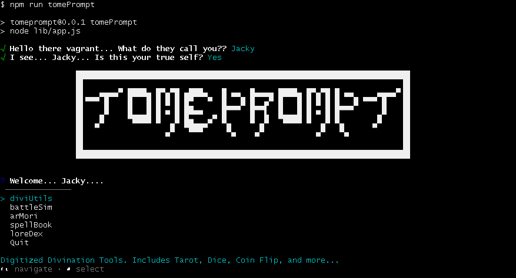

# 🕯️Welcome to.... 
tomePrompt is a CLI App and Micro JRPG made with plain ole JavaScript. Currently I'm utilizing 2 libraries, [@inquirer/prompts](https://github.com/SBoudrias/Inquirer.js "GitHub Repo for @inquirer/prompts") by SBoudrias for the CLI itself, and [CLI-Frames](https://github.com/IonicaBizau/node-cli-frames "GitHub Repo for CLI-Frames") by IonicaBizau for handling animations.

This project is still in early development, so keep your eyes peeled for updates!

Thanks!

-Jacky 🖤

(2/21/26, Hey yall, halting development on this project for a bit. I feel it's gone a bit out of my current scope so I'm gonna take some time to strengthen up my current programming knowledge.)

Clone the repo, cd into the tomePrompt directory, and try out the current build with:
```bash
npm run tomePrompt
```

